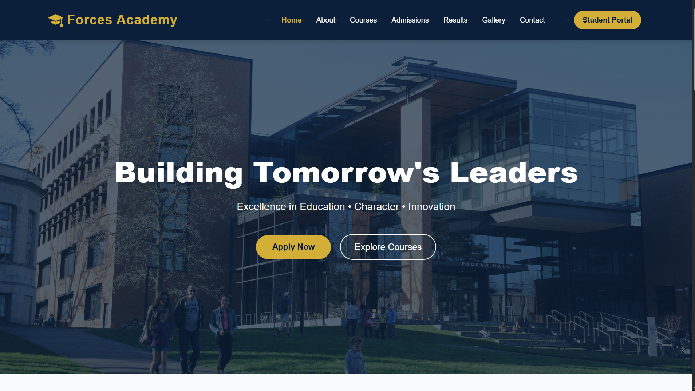
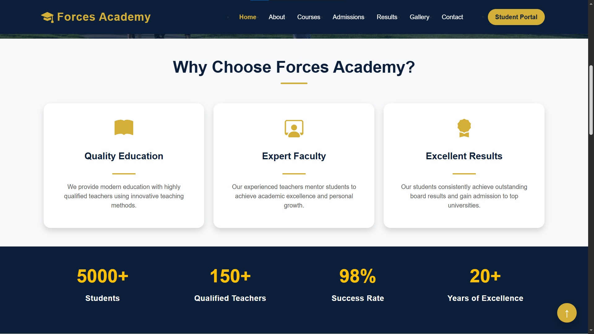
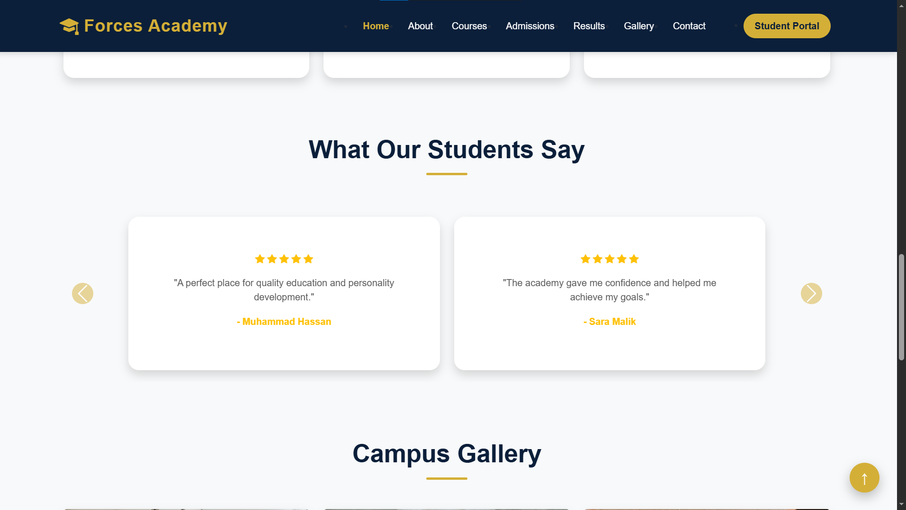
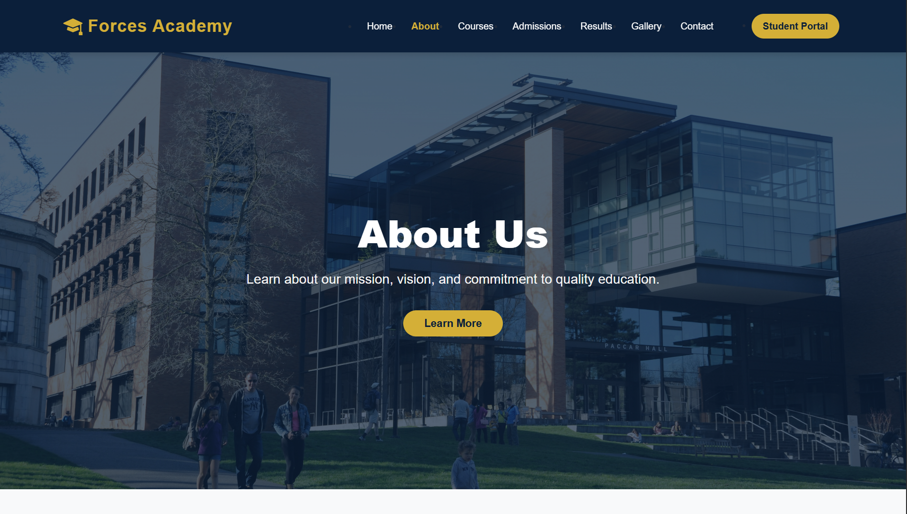
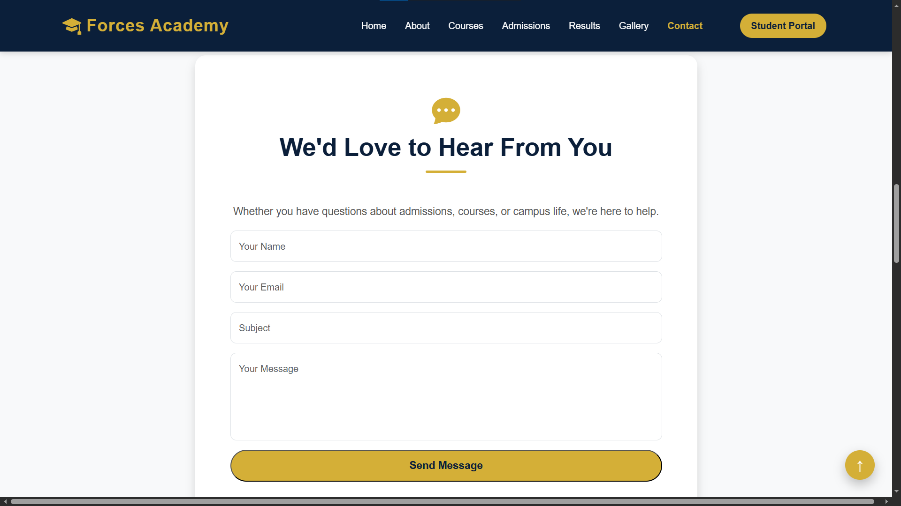

Forces Academy
Frontend | Code Saviours SI-26 | Nimra Noor
# 🎓 Forces Academy Faisalabad Website

A modern, responsive educational website developed as part of the **Frontend Development Internship**.

## 📖 Project Overview

This project represents the official website of **Forces Academy Faisalabad**. It provides visitors with information about the academy, available courses, admissions, results, gallery, and contact details through a clean and responsive user interface.

---

## ✨ Features

- Responsive Design
- Modern User Interface
- Bootstrap 5 Components
- Interactive Navigation
- Student Portal Button
- Hero Sections
- Course Information
- Admission Process
- Results Page
- Image Gallery
- Contact Form
- Google Maps Integration
- Back to Top Button
- Hover Animations
- Responsive Footer

---

## 📄 Website Pages

- Home
- About
- Courses
- Admissions
- Results
- Gallery
- Contact

---

## 🛠️ Technologies Used

- HTML5
- CSS3
- Bootstrap 5
- Bootstrap Icons
- JavaScript

---

## 📁 Project Structure

```
forces-academy/
│
├── css/
│   └── style.css
│
├── js/
│   └── main.js
│
├── images/
│
├── index.html
├── about.html
├── courses.html
├── admissions.html
├── results.html
├── gallery.html
├── contact.html
└── README.md
```

---

## 🌐 Live Demo

GitHub Pages:

https://nimranoor27.github.io/forces-academy-frontend-codesaviours-si26-nimra/

## 📷 Screenshots







## 👩‍💻 Developed By

**Nimra Noor**

Frontend Development Internship

2026